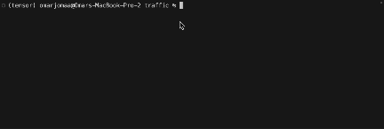

# Traffic Sign Recognition AI

This project leverages TensorFlow and OpenCV to develop an artificial intelligence model for the identification and classification of traffic signs in photographs. The model is trained on the German Traffic Sign Recognition Benchmark (GTSRB) dataset, encompassing thousands of images that span 43 distinct types of road signs.

## Objective

The primary goal is to create a robust neural network capable of recognizing and distinguishing various road signs commonly encountered in urban and highway settings. The model will be trained to understand different sign categories such as stop signs, speed limit signs, yield signs, and more.

The goal of this assignment is to explore the OpenCV and TensorFlow libraries, read the documentation and apply it to the project.

## Observations

**load_data function:**

- The original goal was to find out how to read an image. I read through the documentation on opencv and found the imread function that reads the image as a numpy array of pixels of the image. So I knew that was the right function to use for the image.

    - The problem I had with the image, was that it was in a directory, split into different categories, and then into images in each category. So I had to find a way to tell the script to navigate through the directory, go through each category in the directory, then go through each image in each category and use the imread() function on them. I used google and stackoverflow to find out how to use os to navigate the folder.

    - I used stackoverflow to then find how to resize an image using opencv. This part was straightforward.

**get_model function:**

- After creating the convolutional neural network, I tested out a few different modifications of the network:

    - First I tested the neural network with 1 convolution layer, and 1 pooling layer.

    - Then I started playing around with the number of layers, finding the 3 convolution layers and 2 pooling layers to be the best fit.

    - I also played around with the dropout rates and hidden units, finding 128 units and 0.25 dropout rate giving the best fit.

    - Finally I tried to play around with the filter size and pooling size but I kept getting errors and didnt know exactly how to fix it.

## Visual

**AI model training on data, then classifying the images with a degree of accuracy**

